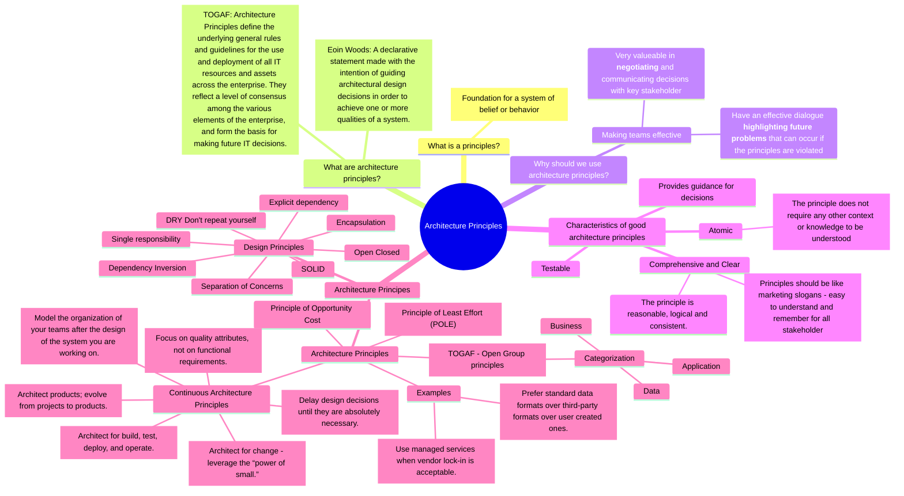

# Architecture Principles

My thoughts and notes about architecture principles.

### Further resources

* [Continuous Architecture Principles](https://continuousarchitecture.com/continuous-architecture-principles/)
* [TOGAF Architecture Principles](https://pubs.opengroup.org/architecture/togaf9-doc/arch/chap20.html)