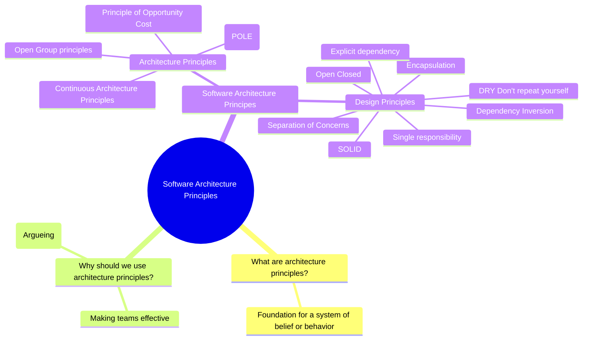

# Software Architecture Principles

My thoughts and notes about software architecture principles.

```mermaid
mindmap
  root((Software Architecture Principles))
    What are architecture principles?
        Foundation for a system of belief or behavior
    Why should we use architecture principles?
        Making teams effective
        Communication (Argueing)
    Software Architecture Principes
        Architecture Principles
            Principle of Least Effort (POLE)
            Principle of Opportunity Cost
            Open Group principles
            Continuous Architecture Principles
        Design Principles
            SOLID
            Separation of Concerns
            Encapsulation
            DRY Don't repeat yourself
            Dependency Inversion
            Explicit dependency
            Single responsibility
            Open Closed
```